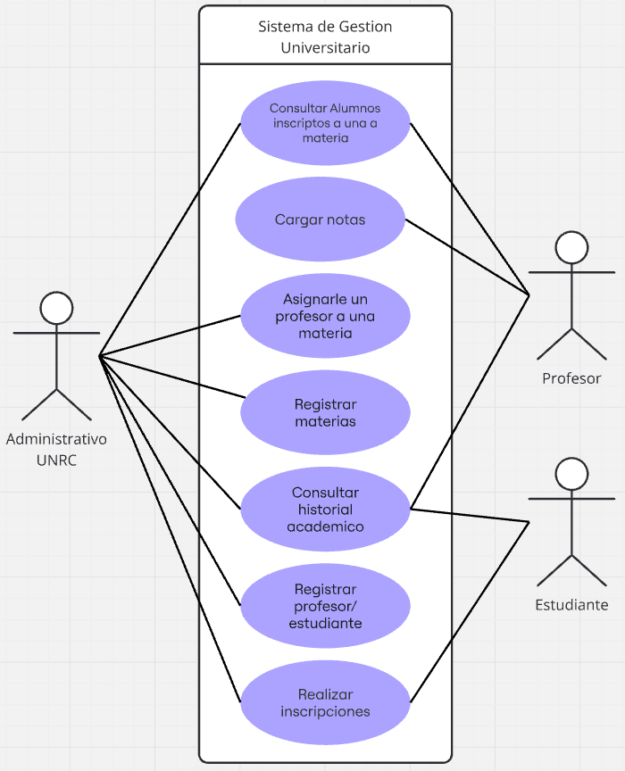

# **Software Requeriment Specification**

# **Proyecto Integrador IS : Sistema de Gestion Universitario**

# **Contenido**

---
## **1 Introducción**
Este documento es una Especificación de Requerimientos de Software para nuestro Sistema de Gestión de Universitario, donde se nos permite gestionar y visualizar a los profesores y a las materias dictadas por una institucion universitaria. Esta especificación esta estructurado basandose en el marco de la Practica Recomendada para Especificaciones de Requisitos de Software,  estándar IEEE 830 - 1998

### **1.1 Proposito**
Este documento tiene como propósito definir las especificaciones funcionales, no funcionales para el desarrollo de un sistema de gestion universitaria  que permitirá gestionar distintos procesos administrativos. El cual será utilizado por el personal administrativo de la institución.

### **1.2 Alcance** 
Durante el desarrollo del proyecto, debido a modificaciones en las fechas de entrega, el principal cambio de alcance fue la reducción del tiempo destinado al testing. 
Esto implicó no poder profundizar en dicha actividad con el nivel de detalle previsto, con el objetivo de cumplir con los plazos de entrega establecidos.

### **1.2.1 Plazo Estimado**

El plazo estima dado para este proyecto fue de 3 semanas, en las cuales se implemento los cambios ya antes mencionados.

### **1.3 Equipo de Trabajo**

| Nombre                  | Juan Ignacio Boyero |
|-------------------------|---------------------|
| Rol                     | Lider De Grupo/Estudiante |
| Categoría Profesional   | Estudiante de Lincenciatura De La Ciencia De La computación |
| Responsabilidad         | Completar el Proyecto |
| Información de contacto |  juanboyero.unrc@gmail.com |

| Nombre                  | Ignacio Javier Bonahora |
|-------------------------|---------------------|
| Rol                     | Integrante del Grupo/Estudiante |
| Categoría Profesional   | Estudiante de Lincenciatura De La Ciencia De La computación |
| Responsabilidad         | Completar el Proyecto |
| Información de contacto | bonahoraignacioj@gmail.com |

| Nombre                  | Agustin Amilcar Laner |
|-------------------------|---------------------|
| Rol                     | Integrante del Grupo/Estudiante |
| Categoría Profesional   | Estudiante de Lincenciatura De La Ciencia De La computación |
| Responsabilidad         | Completar el Proyecto |
| Información de contacto | Agustinnlanerr@gmail.com |

| Nombre                  | Tomás Rosselot |
|-------------------------|---------------------|
| Rol                     | Integrante del Grupo/Estudiante |
| Categoría Profesional   | Estudiante de Lincenciatura De La Ciencia De La computación |
| Responsabilidad         | Completar el Proyecto |
| Información de contacto | totorosselot1@gmail.com |

| Nombre                  | Jose Felipe Romero |
|-------------------------|---------------------|
| Rol                     | Integrante del Grupo/Estudiante |
| Categoría Profesional   | Estudiante de Lincenciatura De La Ciencia De La computación |
| Responsabilidad         | Completar el Proyecto |
| Información de contacto | josefeliperomero823@gmail.com |

#### **1.3.1 Tamaño Del Equipo**
El tamaño ideal para este Sistema de Gestión Estudiantil es de 4 a 6 integrantes.

### **1.4 Definiciones, acronimos y abreviaturas** 

### **1.5 Referencias**
|     Titulo del documento   | Referencia |
|:---------------------------|:-----------|
|Standard IEEE 830-1998      |    IEEE    |

### **1.6 Resumen**
Este documento consta de tres secciones. 
En la primera sección se realiza una introducción al mismo y se proporciona una visión general de la especificación de recursos del sistema.
En la segunda sección del documento se realiza una descripción general del sistema, con
el fin de conocer las principales funciones que éste debe realizar, los datos asociados y los
factores, restricciones, supuestos y dependencias que afectan al desarrollo, sin entrar en
excesivos detalles.
Por último, la tercera sección del documento es aquella en la que se definen detalladamente los requisitos que debe satisfacer el sistema.

---

## **2.Descripción General**

### **2.1 Perspectiva del producto**
El problema a resolver es la realización de un sistema que permita organizar y controlar la información académica de una institución. En particular, se busca gestionar las materias dictadas, los alumnos que pueden cursarlas y los profesores a cargo, centralizando toda esta información en un solo lugar.
### **2.2 Funcionalidad del producto**

El Sistema de Gestión Universitario cuenta con las siguientes funcionalidades, según los roles definidos:

* **Gestión Administrativa:**
    * **Registro de Usuarios:** Alta y modificación de datos de profesores y estudiantes.
    * **Gestión de Materias:** Creación y actualización de las materias de la institución.
    * **Asignación Docente:** Vinculación de profesores con sus respectivas cátedras.
    * **Administración de Inscripciones:** Capacidad para inscribir alumnos en las materias.
    * **Consultas Generales:** Acceso al historial académico de los alumnos y listados de inscriptos por materia.

* **Funcionalidades del Profesor:**
    * **Carga de Notas:** Registro de calificaciones para los estudiantes inscriptos.
    * **Consulta de Comisiones:** Visualización de la lista de alumnos inscriptos en sus materias.

* **Funcionalidades del Estudiante:**
    * **Autogestión de Inscripciones:** Inscripción a las materias disponibles.
    * **Consulta de Situación Académica:** Acceso al historial académico personal para verificar materias y notas.

### **2.3 Caracteristicas de los usuarios** 
#### 2.3.1 **Usuarios del sistema**
 - Personal de la Oficina de Alumnos: Actúan como los administradores del sistema. Su función principal es centralizar la información, llevar el registro de estudiantes y profesores, y gestionar la oferta académica y correlatividades.
 - Estudiantes: Utilizan el sistema para consultar su información académica. Esto incluye ver qué materias están cursando, cuáles pueden cursar según su avance y revisar sus notas finales de aprobación.
 - Profesores: Acceden al sistema para cargar notas y consultar los listados de sus alumnos. También se los registra para saber qué materias están dictando y su cargo (responsable de cátedra, JTP o ayudante)

### **2.4 Resticciones**
**Las recticciones tecnicas del sistema son:**
- Las tecnologías utilizadas son: JAVA, Mustache, SQLite, Spark y Maven Apache.
- La interfaz sera a traves de un sistema web, que correra en cualquier navegador.
- El sistema puede correr en sistema operativo.
- El sistema es dependiente de una conexión a internet.
- El sistema se modelara en un modelo cliente/servidor.
- La manipulacion del sistema sera unicamente por parte de los usuarios.
- La implentacion de este sistema debe contar con un patron de diseño identificable y sencillo.
- Debe contar con una conexion eficiente a un base de datos ligera.

  ### **2.4.1 Justificación del Stack Tecnológico**

| Tecnología | Categoría | Justificación de su uso |
| :--- | :--- | :--- |
| **Java** | Lenguaje de Programación | Proporciona un entorno de ejecución robusto y orientado a objetos, ideal para modelar la lógica de negocio de una gestión universitaria compleja. |
| **Spark Framework** | Framework Web | Micro-framework que permite una configuración rápida de rutas y servicios REST sin la sobrecarga de servidores de aplicaciones más pesados. |
| **Mustache** | Motor de Plantillas | Facilita la renderización de vistas dinámicas manteniendo una separación estricta entre el diseño HTML y el código fuente de la aplicación. |
| **SQLite** | Base de Datos | Motor de base de datos relacional embebido que elimina la necesidad de un servidor externo, garantizando la portabilidad del sistema entre diferentes estaciones de trabajo. |
| **Apache Maven** | Gestión de Proyecto | Automatiza el manejo de dependencias y el proceso de compilación, asegurando que el entorno de desarrollo sea consistente para todos los integrantes del equipo. |

### **2.5 Suposiciones y dependencias**
Los problemas que encontramos sobre suposiciones y dependencias fueron las siguientes:
- Al crear un usuario debemos validar que el email tenga un formato valido.
- Al crear un usuario debemos validar que la contraseña tenga un formato valido.
- Para logearse, un usuario debe introducir un email y contraseña valido.
- Al crear un profesor no podemos dejar campos nulos.
- Al cargar el DNI de un profesor debemos contar con el formato establecido.
- Al crear un profesor debemos cerciorarnos que la materia a la que lo queremos asociar exista.
- Al crear una materia no debemos dejar campos nulos.

---

## **3.Requerimientos Especificos** 

### **3.1 Requisitos comunes de las interfaces**

#### 3.1.1 Interfaces de usuario
La interface de usuario va estar determinada por un conjunto de ventanas y botones que permitiran visualizar las distintas funcionalidades del mismo.
-Este contara con una ventana inicial de login, esta sirve para iniciar sesión 
-Despues de iniciar sesión tendremos un dashbord con las secciones definidas y los botones para cada funcionalidad.

#### 3.1.2 Interfaces de hardware
Como interface de hardware contaremos con 2 tipos de hardware:
- Hardware para el servidor:
   - Debe contar con una computadora con un sistema operativo de tipo server (MS- Windows Server)
    - Red estable por conexión ethernet, con una velocidad de 100 Mb/s o superior
    - Un procesador de 1.4 GHz o superior 
    - Una memoria ram de 4.0 GBs o superior
    - Un almacenamiento interno de 60 GB o superior

- Hardware para el usuario: 
    - Debe contar con una computadora con cualquier sistema operativo, un navegador instalado y conexión estable a internet 
    - Un procesador de 1.0 GHz o superior 
    - Una memoria ram de 2.0 GBs o superior

#### 3.1.3 Interfaces del software
- Sistema Operativo: es posible utilizarse en cualquier sistema operativo
  - Windows, Linux o Mac Os

-Navegador web: Chrome, Brave, Mozilla, Chromium, Opera, Edge o Safarí. 

#### 3.1.4 Interfaces de comunicación
Los servidores, clientes y aplicaciones se comunicarán entre sí, mediante protocolos estándares en internet, siempre que sea posible.

### **3.2 Requerimientos funcionales**

### **3.3 Requerimientos no funcionales**  

#### 3.3.1 Requisitos de rendimiento 
- Garantizar que el diseño de las consultas u otro proceso no afecte el rendimiento de la base de datos, ni considerablemente de la red.

#### 3.3.2 Seguridad 
- Garantizar la confiabilidad, la seguridad y el desempeño del sistema informático a los diferentes usuarios. En este sentido la información almacenada o registros realizados podrán ser consultados y actualizados permanente y simultáneamente, sin que se afecte el tiempo de respuesta.
- Garantizar la seguridad del sistema con respecto a la información y datos que
se manejan tales sean emails y contraseñas.
- Facilidades y controles para permitir el acceso a la información al personal autorizado a través de Internet, con la intención de consultar y subir información pertinente para cada una de ellas.

#### 3.3.3 Fiabilidad
- El sistema debe tener una interfaz de uso intuitiva y sencilla.
- La interfaz de usuario debe ajustarse a las características de la web de la institución, dentro de la cual estará incorporado el sistema de gestión de profesores.

#### 3.3.4 Disponibilidad
- La disponibilidad del sistema debe ser continua con un nivel de servicio para
los usuarios de dispobilidad diaria, las 24 hs.

#### 3.3.5 Mantenibilidad
- El sistema debe disponer de una documentación fácilmente actualizable que permita realizar operaciones de mantenimiento con el menor esfuerzo posible.
- La interfaz debe estar complementada con un buen sistema de ayuda (la
administración puede recaer en personal con poca experiencia en el uso de
aplicaciones informáticas).

#### 3.3.6 Portabilidad
- El sistema puede ser utilizado en cualquier sistema operativo y cualquier navegador.

---

